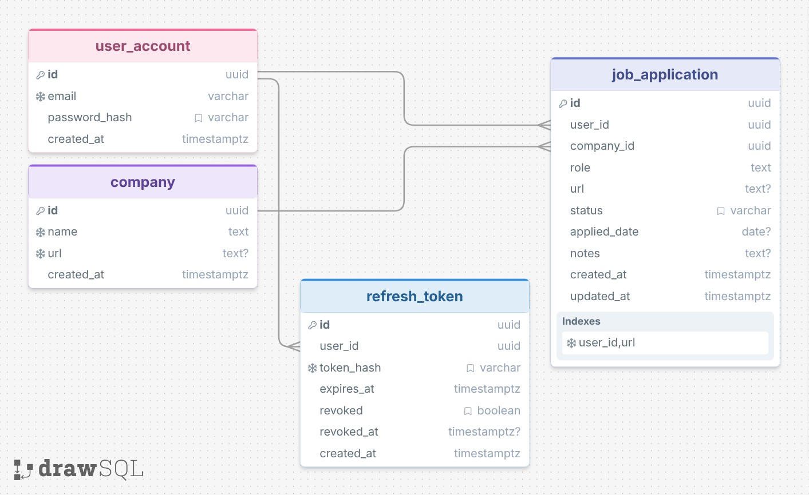

# Stasher

Web app for tracking job applications, with a Chrome extension as the key differentiator: a "Save" button on a job posting page (LinkedIn, in the MVP) automatically captures the data and pre-fills the application in the app.

## Stack

- **Backend:** Spring Boot, PostgreSQL, Flyway, JWT (access + refresh token)
- **Frontend:** Next.js, TypeScript, Tailwind CSS, TanStack Query, Axios
- **Chrome extension:** Manifest V3, React + TypeScript, Shadow DOM
- **Testing:** JUnit + Mockito + Testcontainers (backend), Vitest + React Testing
  Library (frontend), Playwright (E2E)
- **CI/CD:** GitHub Actions
- **Hosting:** Vercel (frontend), Render (backend), Neon (PostgreSQL)

## Architecture

Modular monolith - a single deployment process, internally split into domain
modules, each following a Controller → Service → Repository layering.

## Database Schema



## Repository structure

```
stasher/
├── backend/            Spring Boot (Maven), one package per domain module
│   ├── auth/           Login, register, tokens (User, RefreshToken)
│   ├── jobapplication/ Job applications (core resource)
│   ├── company/        Companies (no own endpoints - resolved internally)
│   └── config/         Cross-cutting: security, JWT filter
├── frontend/           Next.js
├── extension/          Chrome extension (Manifest V3)
├── packages/
│   └── shared-types/   TypeScript types shared between frontend and extension
└── .github/workflows/  CI/CD
```

Each backend module follows the Controller → Service → Repository layering
(package-by-feature, not package-by-layer).

## Getting started

Requires:
- [Docker](https://docs.docker.com/get-docker/) - runs the local PostgreSQL instance
- [Node.js](https://nodejs.org/) 24+ - frontend and shared packages
- JDK 25 - backend

1. Clone the repo:
   ```
   git clone https://github.com/RafaelPinto99/stasher.git
   cd stasher
   ```
2. Copy the root environment template and fill in your own local credentials:
   ```
   cp .env.example .env
   ```
3. Start the database:
   ```
   docker compose up -d
   ```
4. Copy the backend's local config template, using the same credentials as `.env`:
   ```
   cp backend/src/main/resources/application-local.yaml.example backend/src/main/resources/application-local.yaml
   ```
5. Install JS dependencies (frontend + shared packages, via npm workspaces):
   ```
   npm install
   ```
6. Run the backend:
   ```
   cd backend
   ./mvnw spring-boot:run
   ```
7. In a separate terminal, run the frontend:
   ```
   npm run dev -w frontend
   ```

## Status

Early development.
